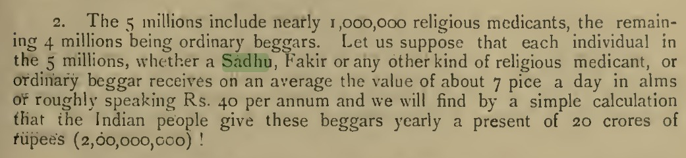
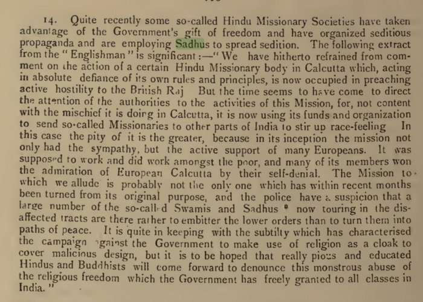
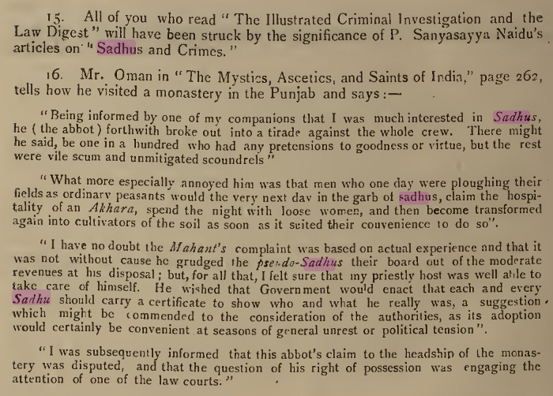
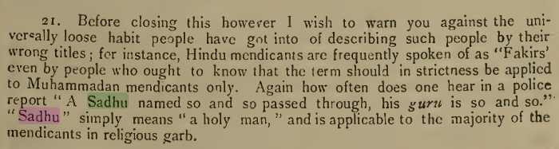
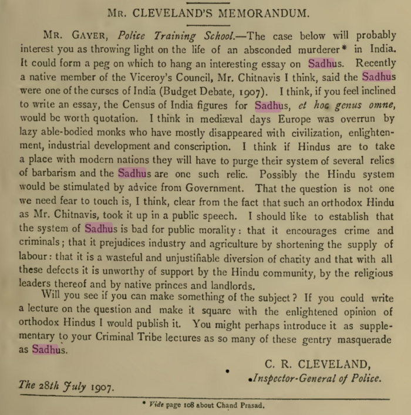

The Criminal Tribes Act of 1871 allowed the British to notify any “tribe” as criminal, i.e. they were criminals by birth or by association. By 1947 over 200 tribes across India were classified as criminals with no criminal background.

Hindu Sadhus (Monks) were one such group to be classified as such.

Post 1947, the Criminal Tribes Act was repealed in 1949. But a new act Habitual Offenders Act, 1952 was introduced. This in practice allowed the continuation of the original Criminal Tribes Act of 1871.

In 2017 a working group was constituted to repeal the hangover of CTA in HOA. And the committee made many observations and recommendations. Some of them are:

> Abolish the Habitual Offenders’ Act, 1952. This Act which is similar in spirit to the  repealed Criminal Tribes Act of 1871 should be abolished as a first step towards de-criminalisation of DNTs and prevention of atrocities by police.
>
> Revisit existing Acts: to ensure that the safety and livelihood opportunities of DNT communities are protected and promoted adequately.
>
> The Prevention of Begging Act 1959: Re-examine definitions relating to criminalization of certain categories of DNTs
>
> The Bombay Prevention of Begging Act 1959: Re-examine this and similar laws in urban areas all over the country that target street performing nomadic communities such as acrobats, tight rope walkers, dancers and singers.

Indian system continues to remain hostile to Hindu Sadhus. These acts mentioned above are just some of them.

References:
- [RareBooks - Police manual on criminal tribes - PDF](police_manual_criminal_tribes.pdf)
- [National Advisory Council Working Group on Denotified and Nomadic Tribes - PDF](dnt_draft.pdf)
