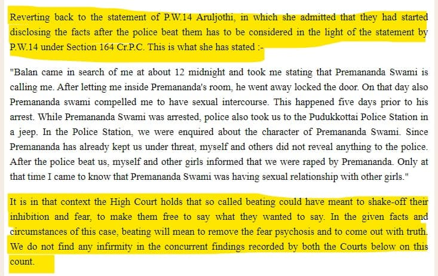

## Is custodial torture be justified ?

Prohibition on use of torture is 'jus cogens' and supersedes all treaties and customary law that use torture. And was ratified by UN Convention on 10 December 1984 and came into effect on 26 June 1987.

On 14 October 1997, India became signatory to the United Nations Convention against torture.
India is yet to pass a law to put an end to torture. Police custodial torture is the most common form of torture.

Custodial police torture is not only common knowledge but also has a acceptance by popular culture and legal system. The culture of custodial torture is not hidden in shadows it out wide in open.

Any attempt to replace physical torture with lie-detector, narco analysis etc has failed as India relies on confessional paradigm. Any physical torture is perceived to be the most effective tool.
Prosecution witnessnes have also been victims of police torture inorder to produce a favorable outcome.

## Case Study 

A witness began to producing favorable statements favorable for prosecution post costodial torture.
Evidence obtained under torture and coersion is tained and to be thrown out. 
This evidence produced under torture was accepted by trial court as was instrumental in rendering the quilty verdict. 

The question of evidence by torture was upheld in a 2-judge bench by both High Court of Chennai **Chandradevi (A-3) vs State Of Tamil Nadu on 12 December, 2002** and Supreme Court of India . ***Kamalanantha And Ors vs State Of Tamil Nadu on 5 April, 2005***. 

The courts reasoned that torture remove the fear psychosis and reveal the truth.

In a 2 year study in the emergency ward of just one hospital in the town of Amritsar, Punjab identified 21 victims of custodial torture. Both men and women are the victims of torture.

The legal protection given to police in matters of torture for both confession and generation of witness has lead to escalation.

Today extra-judicial killing by police is an accepted norm and enjoy popular and legal support.

It is not uncommon for sitting legislatures, ministers and Chief Ministers calling out to police to undertake encounter killings in open media. It no longer lurks in shadows.

### References

1. Vohra, Vijay & Mittal, Deep & Agarwal, Harish & Singh, Dildar & Malik, Shamsher. (2019). Custodial Torture: A Two Years Prospective Study. Medico-Legal Update. 19. 307. 10.5958/0974-1283.2019.00193.2.  https://www.researchgate.net/publication/335038691_Custodial_Torture_A_Two_Years_Prospective_Study

2. Chandradevi (A-3) vs State Of Tamil Nadu on 12 December, 2002 https://indiankanoon.org/doc/12253/

3. Kamalanantha And Ors vs State Of Tamil Nadu on 5 April, 2005 https://indiankanoon.org/doc/192852

4. https://indianexpress.com/article/india/first-16-months-of-yogi-adityanath-govt-over-3000-encounters-78-killed-5554496/

5. https://www.thehansindia.com/telangana/jagga-reddys-poser-to-police-can-cops-kill-swami-nithyananda-in-encounter-588076

6. https://scroll.in/latest/945978/top-news-hyderabad-police-claim-vet-rape-murder-accused-tried-to-flee-were-killed-in-self-defence