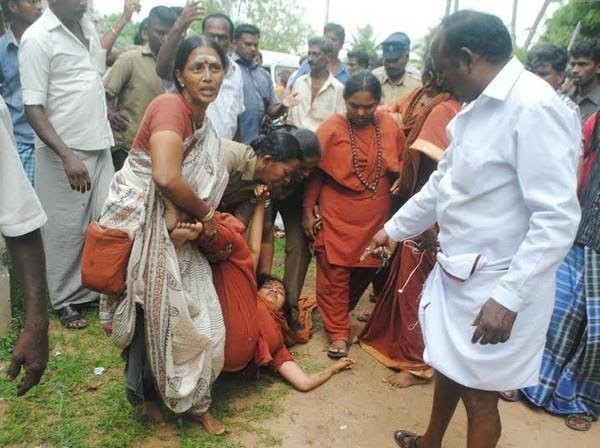

Hinduism is rooted in the worship of primordial divinity as mother. Practicing Hindus, especially Hindu monks and Gurus (spiritual leaders and teachers) are relentlessly persecuted. The most vulnerable target amongst them are Hindu nuns.

This continuous genocide goes back at least 1000 years. Hindus have been silenced and are unable to talk about their trauma. The healing process of their transgenerational trauma is yet to begin.

Reconciliation is a process where perpetrators of crimes against humanity have acknowledged the wrongdoings. Reconciliation by the South African government in case of Apartheid involved:
1. acknowledging wrong was done

2. stopping it, and compensating victims

3. showing a strong commitment to non-repetition of the wrongs.

Likewise globally there is recognition of wrongdoings done against various groups and communities. Hindus in spite of millions killed and displacements are to find any internal (within the country) and external (Internationally) reconciliation.

The first step is to acknowledge that a wrong has been done to Hindus and ensure there would be no repetition. Unfortunately, Hindus continue to be persecuted in their own land. How long can Hindus turn to the rulers — state and media, who are the perpetrators and instigators of the genocide against them.

The Hindu Genocide has evolved into a cold Genocide. Hindus are denied their due rights. Those who stand up are punished, those who stand up the most are punished the most. Even now, Hindus are forced to choose between their life and their Human Rights.

Hindus are the most marginalized community in the world. The overwhelming majority of the Hindus are denied the basic religious freedom to run their own religious institutions. This denial is just the tip of the iceberg. Hindus have fled all over the world for protection and freedom. Hindus have been very grateful towards their adopted land by being the most non-violent, least crime and most contributing members of the society.

The report on Adi-Shaivite (ASMT) women published by the UN is the first public report on the persecution of Hindus that continues to happen even now. This publication is the result of the persistence of the most persecuted group of the most persecuted Hindu Guru — Supreme Pontiff of Hinduism (SPH) Sri Nithyananda Paramashivam. This recognizes the existence of contemporary Hindu persecution by state and media — a necessary first step. While Hindus are victims of lawfare and instigation by state and media has robbed them of the bandwidth and capability to present their plight to the global community. There is nobody to help or listen to the plight of Hindus. There is no place Hindus can call their home where they can live and practice their religion in peace.

As the global community begins to take notice of persecution against Hindus another case of persecution of a well-known Hindu Guru by state and aided my media is underway.

Until Hindus are given their political and legal protection to live in peace there will be no end to the persecution of Hindus. Civilizing Hindus continues to remain as the justification for the persecution of Hindus to date. This can only stop when Hindus have a country of their own and are left to practice their religion in peace until such a time when persecution of Hindus can be brought to a permanent end.

Read the UN report at https://www.ohchr.org/Documents/HRBodies/CEDAW/DGD24June2021/51.docx